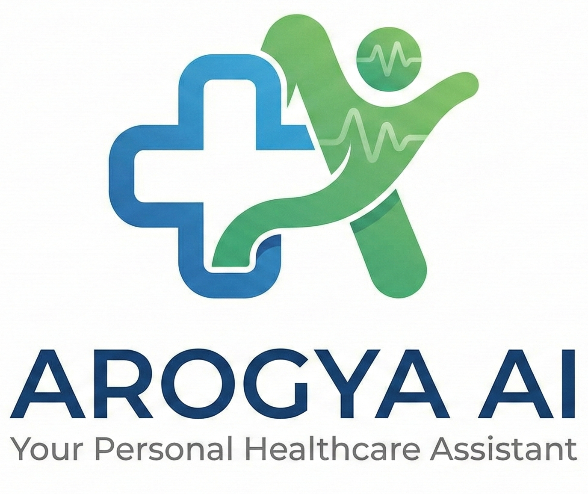
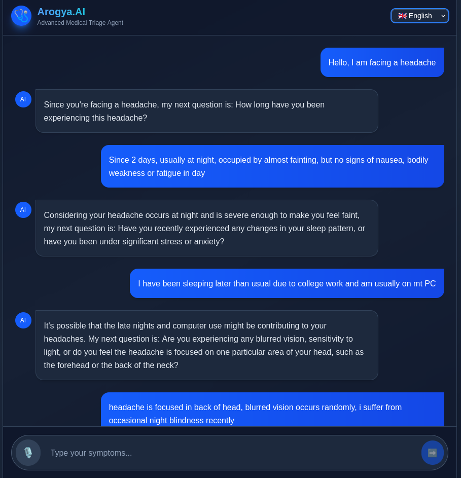
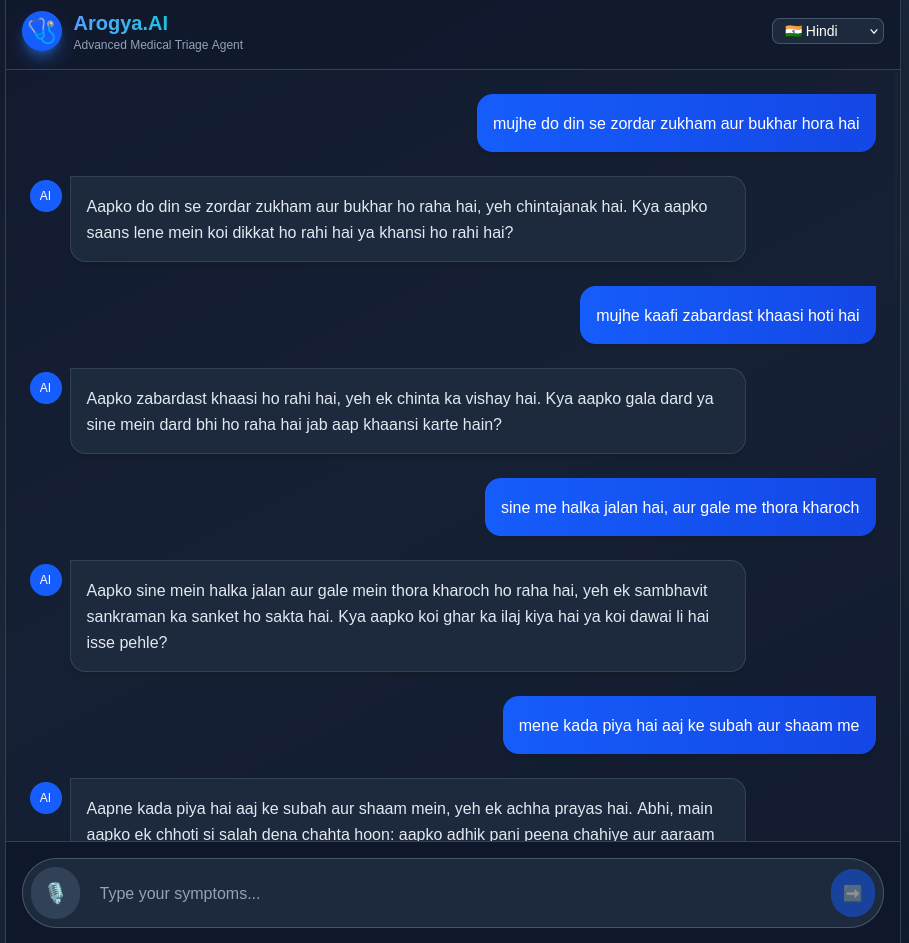
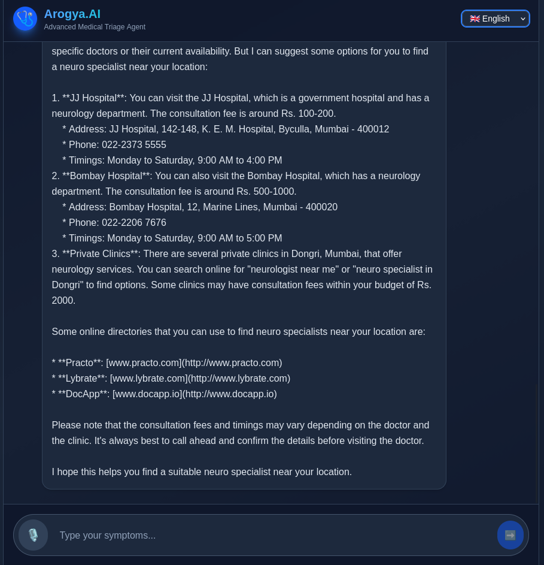

# 

**Arogya AI — Your Personal Healthcare Assistant Powered by Agentic Intelligence**

---

## 🌟 Premise of the Project
Arogya AI is an intelligent medical assistant that interacts with users, understands their symptoms, and provides helpful medical guidance. It speaks multiple languages, considers the user’s location to suggest nearby hospitals or pharmacies, and aims to make basic medical advice accessible to everyone.

This project uses an **agentic AI approach** — meaning the AI is not just responding with static outputs but is actively:
- Asking follow-up questions
- Taking decisions based on user context
- Using tools like geolocation and multilingual generation
- Guiding the user through the entire healthcare query flow like a real agent

Our goal is to bridge the accessibility gap in primary healthcare using responsible and context-aware AI.

---

## 🧠 Tech Stack

**Frontend:** Next.js  
**Backend:** Flask  
**LLM:** Grok  
**Location Services:** GeoPy  
**Database:** MySQL  

---

## 🔍 Key Features
- Conversational symptom checking
- Context-aware advice powered by agentic reasoning
- Multi-language interaction (English + Indian languages)
- Location-based doctor and clinic suggestions
- Smooth web interface for all users

---

## 📌 Example Use Cases

### 1️⃣ Symptom Checker Conversation  
# 

### 2️⃣ Multi-Language Medical Support  
# 

### 3️⃣ Nearby Healthcare Options   
# 

---

## 🚀 Agentic AI Approach Explained
Traditional chatbots only respond to what you say. Arogya AI **behaves like an intelligent agent**:

1. It proactively asks for missing details  
2. It uses stored data + real-time context like user location  
3. It performs reasoning to guide the user toward the right action  
4. It can dynamically decide the next step in the conversation  

This autonomy makes the system more supportive and practical in real healthcare scenarios.

---

## 🛠️ Installation (Coming Soon…)

---

More features, more languages, and deeper medical knowledge are continuously being added. Arogya AI aims to become a true AI healthcare ally for everyone.
